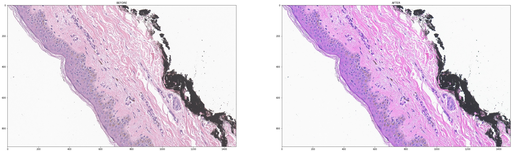

# Color Profile Transformer
 
todo:
dockerize

Installation:

`git clone git@github.com:tourist-C/cms_transformer.git`

Usage:

The ICC color profile of the svs can be obtained by :

The color profile can be extracted by GIMP

Extract: Open the image using GIMP 2.9,
Click on "Image > Color Management > Save Color Profile to File".

or using
ArgyllCMS ( https://www.argyllcms.com/ )
And it allow CLI and thus batch-able

`python cms_transformer.py -tif "color-profile-correction/color-profile-correction/skin-crop-non-color-corrected.tif"`

Result:

